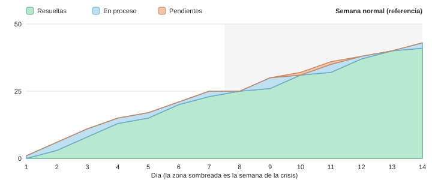
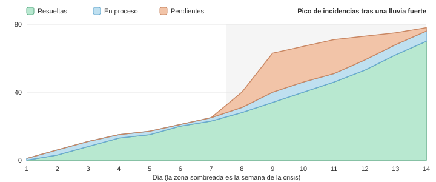
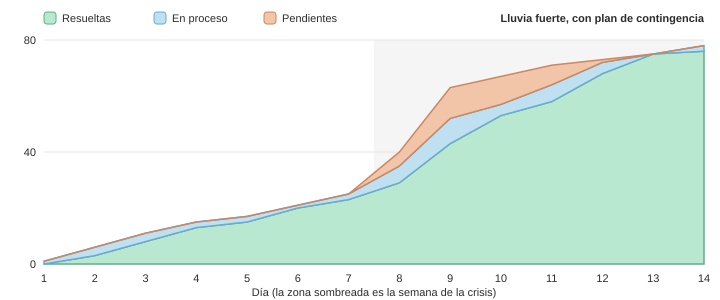
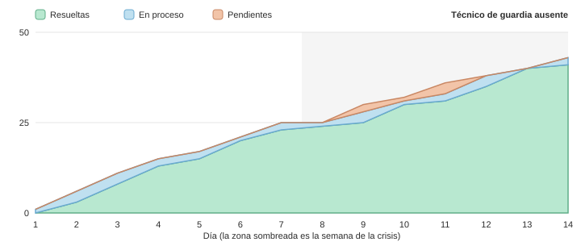
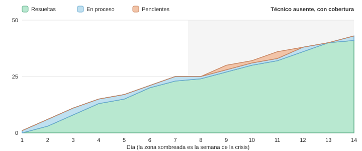
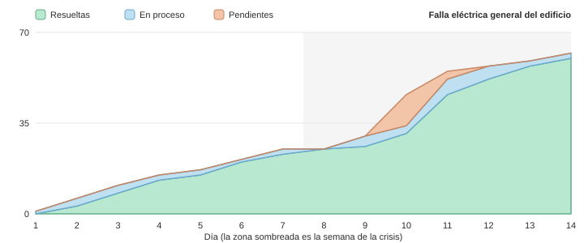
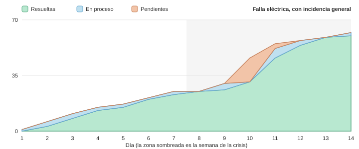

# Situaciones críticas: cycle time, WIP y throughput

Generado con `npm run escenarios` el 2026-09-26. Cada fila es el **promedio de 200 simulaciones** con distintas semillas (el mismo escenario con y sin solución usa exactamente los mismos reportes, para que la comparación sea justa). Los KPIs se calculan con las mismas funciones que el panel del administrador (`src/domain/kpis.ts`), sobre la **semana de la crisis** (días 8 a 14).

## Modelo

- Edificio de ~80 departamentos: unos **3 reportes al día** (85 % entre las 7:00 y las 22:00), 20 % de prioridad alta, 50 % media y 30 % baja.
- **2 técnicos por turnos:** mañana (7:00–15:00) y tarde/guardia (14:00–22:00). Límite de WIP de **3 por técnico**, como en el tablero.
- La cola se atiende por prioridad y luego por antigüedad (el orden del tablero). Una incidencia en proceso primero **espera** (coordinar con el vecino, repuestos o que vuelva la luz) sin ocupar al técnico, y luego necesita **trabajo**: el técnico atiende una a la vez.
- **Cycle time** = fecha de resolución − fecha de inicio; **lead time** = fecha de resolución − fecha de reporte (promedios de las resueltas en la semana). **Throughput** = resueltas por día. **WIP** = incidencias en proceso, promediado en el tiempo.
- **Ley de Little:** WIP = throughput × cycle time (con el throughput en incidencias por hora). Si el WIP calculado así se parece al medido, el sistema está estable; si no, se está acumulando trabajo.

## Resultados (TF 5.2)

| Situación | Cycle time (todas · alta) | WIP medido | Throughput | WIP por Little (TH × CT) | Lead time (todas · alta) | Pendientes al cierre |
|---|---|---|---|---|---|---|
| Semana normal (referencia) | 12,3 h · alta 5,8 h | 1,5 promedio · pico 4,5 | 3,0 / día | 1,5 | 13,2 h · alta 6,5 h | 0,1 |
| Pico de incidencias tras una lluvia fuerte | 17,6 h · alta 14,8 h | 5,1 promedio · pico 6,0 | 6,8 / día | 5,0 | 53,5 h · alta 28,4 h | 6,5 |
| Técnico de guardia ausente | 15,9 h · alta 7,0 h | 2,0 promedio · pico 4,1 | 3,0 / día | 2,0 | 21,3 h · alta 12,1 h | 0,1 |
| Falla eléctrica general del edificio | 13,8 h · alta 11,7 h | 3,3 promedio · pico 6,0 | 5,7 / día | 3,3 | 24,9 h · alta 20,9 h | 0,1 |

## Con la solución propuesta (TF 5.3)

| Situación | Cycle time (todas · alta) | WIP medido | Throughput | WIP por Little (TH × CT) | Lead time (todas · alta) | Pendientes al cierre |
|---|---|---|---|---|---|---|
| Pico de incidencias tras una lluvia fuerte | 17,6 h · alta 14,8 h | 5,1 promedio · pico 6,0 | 6,8 / día | 5,0 | 53,5 h · alta 28,4 h | 6,5 |
| Lluvia fuerte, con plan de contingencia | 14,7 h · alta 10,1 h | 5,4 promedio · pico 9,0 | 8,0 / día | 4,9 | 30,6 h · alta 14,0 h | 0,3 |
| Técnico de guardia ausente | 15,9 h · alta 7,0 h | 2,0 promedio · pico 4,1 | 3,0 / día | 2,0 | 21,3 h · alta 12,1 h | 0,1 |
| Técnico ausente, con cobertura | 13,9 h · alta 7,4 h | 1,7 promedio · pico 4,2 | 3,0 / día | 1,7 | 15,9 h · alta 8,1 h | 0,1 |
| Falla eléctrica general del edificio | 13,8 h · alta 11,7 h | 3,3 promedio · pico 6,0 | 5,7 / día | 3,3 | 24,9 h · alta 20,9 h | 0,1 |
| Falla eléctrica, con incidencia general | 10,4 h · alta 7,6 h | 2,3 promedio · pico 5,9 | 5,7 / día | 2,5 | 13,1 h · alta 10,9 h | 0,1 |

## Detalle de cada escenario

### Semana normal (referencia)

Unos 3 reportes al día y 2 técnicos por turnos (7:00–15:00 y 14:00–22:00), con límite de WIP de 3 cada uno.

- Reportes en la semana: 20,8 · resueltas por día: 3,0 · pendientes al cierre: 0,1
- Cycle time: 12,3 h (alta: 5,8 h, meta del Objetivo 2: < 48 h) · lead time: 13,2 h (alta: 6,5 h)
- WIP: 1,5 en promedio, pico de 4,5 (tope del tablero: 3 por técnico)

### Pico de incidencias tras una lluvia fuerte

Una lluvia fuerte de 36 h genera filtraciones, un sótano inundado y desagües atorados: llegan ~1 reporte por hora (casi la mitad de prioridad alta) además de los normales.

- Reportes en la semana: 57,5 · resueltas por día: 6,8 · pendientes al cierre: 6,5
- Cycle time: 17,6 h (alta: 14,8 h, meta del Objetivo 2: < 48 h) · lead time: 53,5 h (alta: 28,4 h)
- WIP: 5,1 en promedio, pico de 6,0 (tope del tablero: 3 por técnico)

### Lluvia fuerte, con plan de contingencia

La misma lluvia.

**Solución:** Durante 72 h el administrador activa un gasfitero externo (7:00–22:00) y pone en pausa las incidencias de prioridad baja: el tablero ya las ordena por la prioridad que sugiere la IA.

- Reportes en la semana: 57,5 · resueltas por día: 8,0 · pendientes al cierre: 0,3
- Cycle time: 14,7 h (alta: 10,1 h, meta del Objetivo 2: < 48 h) · lead time: 30,6 h (alta: 14,0 h)
- WIP: 5,4 en promedio, pico de 9,0 (tope del tablero: 3 por técnico)

### Técnico de guardia ausente

El técnico de la tarde (guardia) falta 5 días seguidos por enfermedad y nadie cubre su turno: todo recae en el técnico de la mañana.

- Reportes en la semana: 20,8 · resueltas por día: 3,0 · pendientes al cierre: 0,1
- Cycle time: 15,9 h (alta: 7,0 h, meta del Objetivo 2: < 48 h) · lead time: 21,3 h (alta: 12,1 h)
- WIP: 2,0 en promedio, pico de 4,1 (tope del tablero: 3 por técnico)

### Técnico ausente, con cobertura

La misma ausencia.

**Solución:** El técnico de la mañana extiende su turno hasta las 19:00 mientras dure la ausencia, y un técnico de reemplazo cubre la guardia de la tarde solo para incidencias de prioridad alta.

- Reportes en la semana: 20,8 · resueltas por día: 3,0 · pendientes al cierre: 0,1
- Cycle time: 13,9 h (alta: 7,4 h, meta del Objetivo 2: < 48 h) · lead time: 15,9 h (alta: 8,1 h)
- WIP: 1,7 en promedio, pico de 4,2 (tope del tablero: 3 por técnico)

### Falla eléctrica general del edificio

Un corte de luz de 6 h (de 19:00 a 1:00) detiene el ascensor, la bomba de agua y el intercomunicador. 14 vecinos reportan lo mismo en 2 horas y nada se puede reparar hasta que vuelva la luz; al día siguiente aparecen 5 equipos dañados.

- Reportes en la semana: 39,8 · resueltas por día: 5,7 · pendientes al cierre: 0,1
- Cycle time: 13,8 h (alta: 11,7 h, meta del Objetivo 2: < 48 h) · lead time: 24,9 h (alta: 20,9 h)
- WIP: 3,3 en promedio, pico de 6,0 (tope del tablero: 3 por técnico)

### Falla eléctrica, con incidencia general

El mismo corte de luz.

**Solución:** El administrador registra una sola "incidencia general" del apagón y se la asigna a un electricista de guardia, que la atiende apenas vuelve la luz (1:00–5:00). Los reportes repetidos no ocupan a los técnicos: se cierran junto con la general y FixIt avisa a cada vecino.

- Reportes en la semana: 39,8 · resueltas por día: 5,7 · pendientes al cierre: 0,1
- Cycle time: 10,4 h (alta: 7,6 h, meta del Objetivo 2: < 48 h) · lead time: 13,1 h (alta: 10,9 h)
- WIP: 2,3 en promedio, pico de 5,9 (tope del tablero: 3 por técnico)

